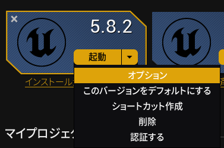
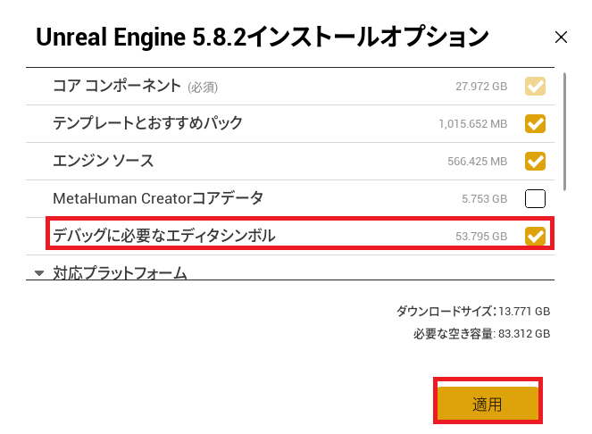

# セットアップ

## エンジンにエディタシンボルを追加
VisualStudioでデバッグを行うためにエディタのシンボルをインストール
<div style="display: flex; gap: 20px; margin: 20px 0; flex-wrap: wrap;">
	
	
</div>

## VisualStudioのデフォルトエンコードをutf8に設定
.uproectと同じフォルダに.editorconfigを保存
<div style="background-color: #333; color: #fff; padding: 6px 12px; font-family: monospace; font-size: 13px; border-top-left-radius: 6px; border-top-right-radius: 6px; border-bottom: 1px solid #444; font-weight: bold;">
  .editorconfig
</div>
<div style="max-height: 300px; overflow-y: auto; border: 1px solid #ccc; padding: 10px; border-radius: 5px; background-off: #f9f9f9;">

```ini
# Unreal Engine EditorConfig
# トップレベルのEditorConfigファイル
root = true

# すべてのファイルのデフォルト設定
[*]
charset = utf-8
end_of_line = crlf
insert_final_newline = true
trim_trailing_whitespace = true
tab_width = 4
indent_size = 4
dotnet_style_qualification_for_field = false:silent
dotnet_style_qualification_for_property = false:silent
dotnet_style_qualification_for_method = false:silent
dotnet_style_qualification_for_event = false:silent
dotnet_style_parentheses_in_arithmetic_binary_operators = always_for_clarity:silent
dotnet_style_parentheses_in_other_binary_operators = always_for_clarity:silent
dotnet_style_parentheses_in_relational_binary_operators = always_for_clarity:silent
dotnet_style_parentheses_in_other_operators = never_if_unnecessary:silent

# C++ファイル (.h, .cpp, .hpp, .c)
[*.{cpp,h,hpp,c,inl}]
charset = utf-8
indent_style = tab
indent_size = 4
tab_width = 4

# C#ファイル (Build.cs, Target.cs など)
[*.cs]
charset = utf-8
indent_style = tab
indent_size = 4
tab_width = 4

# Unreal ビルドスクリプト
[*.{Build.cs,Target.cs}]
charset = utf-8
indent_style = tab
indent_size = 4

# JSON、設定ファイル
[*.{json,uplugin,uproject}]
charset = utf-8
indent_style = tab
indent_size = 4

# INI設定ファイル
[*.ini]
charset = utf-8
indent_style = space
indent_size = 4

# XML、XAML
[*.{xml,config}]
charset = utf-8
indent_style = tab
indent_size = 2

# Markdown、テキストファイル
[*.{md,txt}]
charset = utf-8
trim_trailing_whitespace = true

# Yamlファイル
[*.{yml,yaml}]
charset = utf-8
indent_style = space
indent_size = 2

# Shaderファイル
[*.{usf,ush,hlsl}]
charset = utf-8
indent_style = tab
indent_size = 4
[*.cs]
#### 命名スタイル ####

# 名前付けルール

dotnet_naming_rule.interface_should_be_begins_with_i.severity = suggestion
dotnet_naming_rule.interface_should_be_begins_with_i.symbols = interface
dotnet_naming_rule.interface_should_be_begins_with_i.style = begins_with_i

dotnet_naming_rule.types_should_be_pascal_case.severity = suggestion
dotnet_naming_rule.types_should_be_pascal_case.symbols = types
dotnet_naming_rule.types_should_be_pascal_case.style = pascal_case

dotnet_naming_rule.non_field_members_should_be_pascal_case.severity = suggestion
dotnet_naming_rule.non_field_members_should_be_pascal_case.symbols = non_field_members
dotnet_naming_rule.non_field_members_should_be_pascal_case.style = pascal_case

# 記号の仕様

dotnet_naming_symbols.interface.applicable_kinds = interface
dotnet_naming_symbols.interface.applicable_accessibilities = public, internal, private, protected, protected_internal, private_protected
dotnet_naming_symbols.interface.required_modifiers = 

dotnet_naming_symbols.types.applicable_kinds = class, struct, interface, enum
dotnet_naming_symbols.types.applicable_accessibilities = public, internal, private, protected, protected_internal, private_protected
dotnet_naming_symbols.types.required_modifiers = 

dotnet_naming_symbols.non_field_members.applicable_kinds = property, event, method
dotnet_naming_symbols.non_field_members.applicable_accessibilities = public, internal, private, protected, protected_internal, private_protected
dotnet_naming_symbols.non_field_members.required_modifiers = 

# 命名スタイル

dotnet_naming_style.begins_with_i.required_prefix = I
dotnet_naming_style.begins_with_i.required_suffix = 
dotnet_naming_style.begins_with_i.word_separator = 
dotnet_naming_style.begins_with_i.capitalization = pascal_case

dotnet_naming_style.pascal_case.required_prefix = 
dotnet_naming_style.pascal_case.required_suffix = 
dotnet_naming_style.pascal_case.word_separator = 
dotnet_naming_style.pascal_case.capitalization = pascal_case

dotnet_naming_style.pascal_case.required_prefix = 
dotnet_naming_style.pascal_case.required_suffix = 
dotnet_naming_style.pascal_case.word_separator = 
dotnet_naming_style.pascal_case.capitalization = pascal_case
csharp_indent_labels = one_less_than_current
csharp_using_directive_placement = outside_namespace:silent
csharp_style_conditional_delegate_call = true:suggestion
csharp_style_var_for_built_in_types = false:silent
csharp_style_var_when_type_is_apparent = false:silent
csharp_style_var_elsewhere = false:silent
csharp_prefer_simple_using_statement = true:suggestion
csharp_prefer_braces = true:silent
csharp_style_namespace_declarations = block_scoped:silent

[*.vb]
#### 命名スタイル ####

# 名前付けルール

dotnet_naming_rule.interface_should_be_i_で始まる.severity = suggestion
dotnet_naming_rule.interface_should_be_i_で始まる.symbols = interface
dotnet_naming_rule.interface_should_be_i_で始まる.style = i_で始まる

dotnet_naming_rule.型_should_be_パスカル_ケース.severity = suggestion
dotnet_naming_rule.型_should_be_パスカル_ケース.symbols = 型
dotnet_naming_rule.型_should_be_パスカル_ケース.style = パスカル_ケース

dotnet_naming_rule.フィールド以外のメンバー_should_be_パスカル_ケース.severity = suggestion
dotnet_naming_rule.フィールド以外のメンバー_should_be_パスカル_ケース.symbols = フィールド以外のメンバー
dotnet_naming_rule.フィールド以外のメンバー_should_be_パスカル_ケース.style = パスカル_ケース

# 記号の仕様

dotnet_naming_symbols.interface.applicable_kinds = interface
dotnet_naming_symbols.interface.applicable_accessibilities = public, friend, private, protected, protected_friend, private_protected
dotnet_naming_symbols.interface.required_modifiers = 

dotnet_naming_symbols.型.applicable_kinds = class, struct, interface, enum
dotnet_naming_symbols.型.applicable_accessibilities = public, friend, private, protected, protected_friend, private_protected
dotnet_naming_symbols.型.required_modifiers = 

dotnet_naming_symbols.フィールド以外のメンバー.applicable_kinds = property, event, method
dotnet_naming_symbols.フィールド以外のメンバー.applicable_accessibilities = public, friend, private, protected, protected_friend, private_protected
dotnet_naming_symbols.フィールド以外のメンバー.required_modifiers = 

# 命名スタイル

dotnet_naming_style.i_で始まる.required_prefix = I
dotnet_naming_style.i_で始まる.required_suffix = 
dotnet_naming_style.i_で始まる.word_separator = 
dotnet_naming_style.i_で始まる.capitalization = pascal_case

dotnet_naming_style.パスカル_ケース.required_prefix = 
dotnet_naming_style.パスカル_ケース.required_suffix = 
dotnet_naming_style.パスカル_ケース.word_separator = 
dotnet_naming_style.パスカル_ケース.capitalization = pascal_case

dotnet_naming_style.パスカル_ケース.required_prefix = 
dotnet_naming_style.パスカル_ケース.required_suffix = 
dotnet_naming_style.パスカル_ケース.word_separator = 
dotnet_naming_style.パスカル_ケース.capitalization = pascal_case
```

</div>

## cpp,hファイルを同一フォルダ内でインクルード
Source/{ProjectName}/{ProjectName}.Build.csでインクルードパスにModuleDirectoryを追加
<div style="background-color: #333; color: #fff; padding: 6px 12px; font-family: monospace; font-size: 13px; border-top-left-radius: 6px; border-top-right-radius: 6px; border-bottom: 1px solid #444; font-weight: bold;">
  MyProject.Build.cs
</div>
<div style="max-height: 300px; overflow-y: auto; border: 1px solid #ccc; padding: 10px; border-radius: 5px; background-off: #f9f9f9;">

```csharp
// Copyright Epic Games, Inc. All Rights Reserved.

using UnrealBuildTool;

public class MyProject : ModuleRules
{
	public MyProject(ReadOnlyTargetRules Target) : base(Target)
	{
		PCHUsage = PCHUsageMode.UseExplicitOrSharedPCHs;
	
		PublicDependencyModuleNames.AddRange(new string[] { "Core", "CoreUObject", "Engine", "InputCore", "EnhancedInput" });

		PrivateDependencyModuleNames.AddRange(new string[] {  });

		// .hと.cppを同一フォルダに配置してインクルードを通す設定
		PublicIncludePaths.AddRange(new string[] { ModuleDirectory });
	}
}
```

</div>

## エディタ環境の設定
### ソースコードエディタの指定
「一般→ソースコード」でソースコードエディタを指定します。
通常はVisualStudioを指定。
### ライブコーディングの無効化
「一般→ライブコーディング」で「ライブコーディングの有効化」をオフ。
### 新規追加C++クラスの自動コンパイルオフ
「一般→未分類→ホットリロード」で「新たに追加されたC++クラスを自動的にコンパイル」をオフ。
### アセットエディタの起動場所を指定
「一般→アピアランス」で「アセットエディタの起動場所」を「Main Window」に設定。

## プロジェクト設定
### 著作権情報の設定
「プロジェクト→説明」で「著作権情報」にコピーライトを記載。
これによりUEでソースコードを作成した際の上部コメントに入る文字列を指定。
```cpp
// Copyright MyGames
```

## 基礎コードのセットアップ
### ログの設定
ログのカテゴリを新規に作成することができます。
自プロジェクト専用のログカテゴリーを作っておくと、フィルタリングで自分が出力したログだけを見ることができます。ログカテゴリはSource/{ProjectName}/直下にヘッダとcppファイルを用意して定義します。
<div style="background-color: #333; color: #fff; padding: 6px 12px; font-family: monospace; font-size: 13px; border-top-left-radius: 6px; border-top-right-radius: 6px; border-bottom: 1px solid #444; font-weight: bold;">
  MyLogChanne.h
</div>
<div style="max-height: 300px; overflow-y: auto; border: 1px solid #ccc; padding: 10px; border-radius: 5px; background-off: #f9f9f9;">

```ini
#pragma once

#include "CoreMinimal.h"
#include "Logging/LogMacros.h"

// LogMyのカテゴリー定義
DECLARE_LOG_CATEGORY_EXTERN(LogMy, Log, All);
```
</div>

<div style="background-color: #333; color: #fff; padding: 6px 12px; font-family: monospace; font-size: 13px; border-top-left-radius: 6px; border-top-right-radius: 6px; border-bottom: 1px solid #444; font-weight: bold;">
  MyLogChannel.cpp
</div>
<div style="max-height: 300px; overflow-y: auto; border: 1px solid #ccc; padding: 10px; border-radius: 5px; background-off: #f9f9f9;">

```ini
#include "MyLogChannels.h"

// LogMyのカテゴリー定義
DEFINE_LOG_CATEGORY(LogMy);
```
</div>

### コリジョンチャンネルの設定
エディタ上ではオブジェクトチャンネル、コリジョンチャンネルはプロジェクト設定で名前を付けることができますがC++には反映されないため、ソースコードで独自に定義する必要があります。  
これはSource/{ProjectName}/{ProjectName}/直下に最初から存在する{ProjectName}.h,{ProjectName}.cppに定義を書く加えます。
<div style="background-color: #333; color: #fff; padding: 6px 12px; font-family: monospace; font-size: 13px; border-top-left-radius: 6px; border-top-right-radius: 6px; border-bottom: 1px solid #444; font-weight: bold;">
  MyProject.h
</div>
<div style="max-height: 300px; overflow-y: auto; border: 1px solid #ccc; padding: 10px; border-radius: 5px; background-off: #f9f9f9;">

```ini
// Copyright Epic Games, Inc. All Rights Reserved.

#pragma once

#include "CoreMinimal.h"

// トレースチャンネル、オブジェクトチャンネルは両方ともECC_GameTraceChannel?を共有する(1～18)
// エディタ上の設定と割り当てられたGameTraceChannelの対応はDefaultConfig.iniを参照

//トレースチャンネルのユーザー定義
#define ECC_CharacterMesh		ECC_GameTraceChannel1
#define ECC_CharacterMeshBlock	ECC_GameTraceChannel2
#define ECC_Climbable			ECC_GameTraceChannel3
#define ECC_Vaultable			ECC_GameTraceChannel4
#define ECC_Water				ECC_GameTraceChannel5
#define ECC_UI					ECC_GameTraceChannel6
#define ECC_Fadeable			ECC_GameTraceChannel7
#define ECC_IKTrace				ECC_GameTraceChannel8
#define ECC_Interactable		ECC_GameTraceChannel9

// オブジェクトチャンネルのユーザー定義
#define ECC_Player				ECC_GameTraceChannel10
#define ECC_Enemy				ECC_GameTraceChannel11
#define ECC_NPCs				ECC_GameTraceChannel12
```
</div>

### ゲームプレイタグの設定
